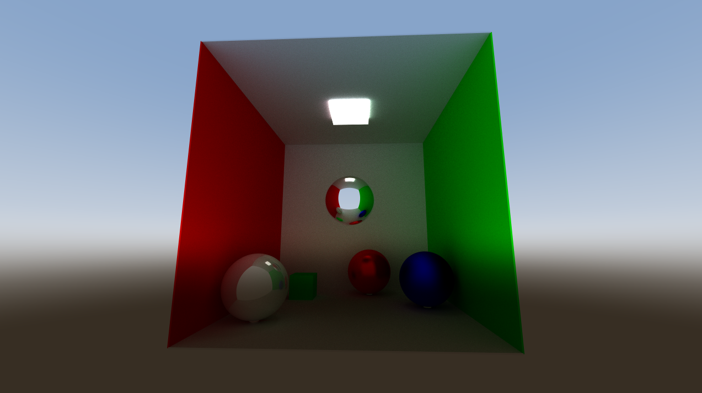

# Godot4-Raytracing
Implementation of ray-tracing in Godot engine, via compute shaders. Focus on realtime performance and optimization.

## Instructions:

Press tab to toggle settings menu, use the slider in the bottom to compare views.

